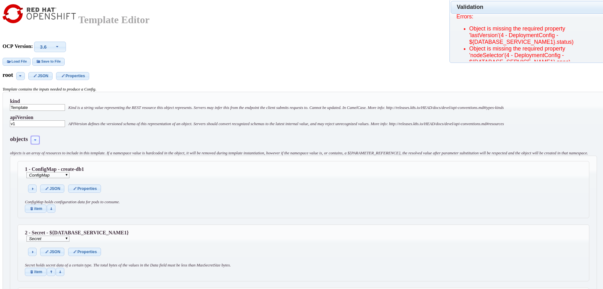
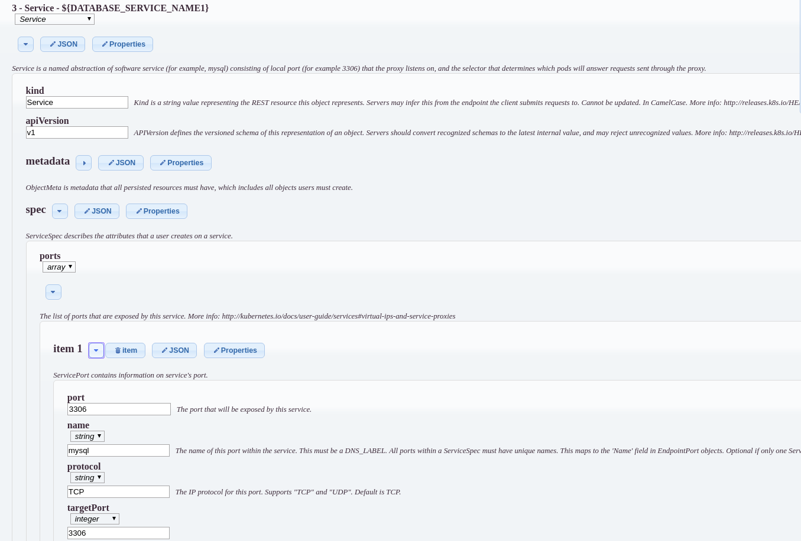
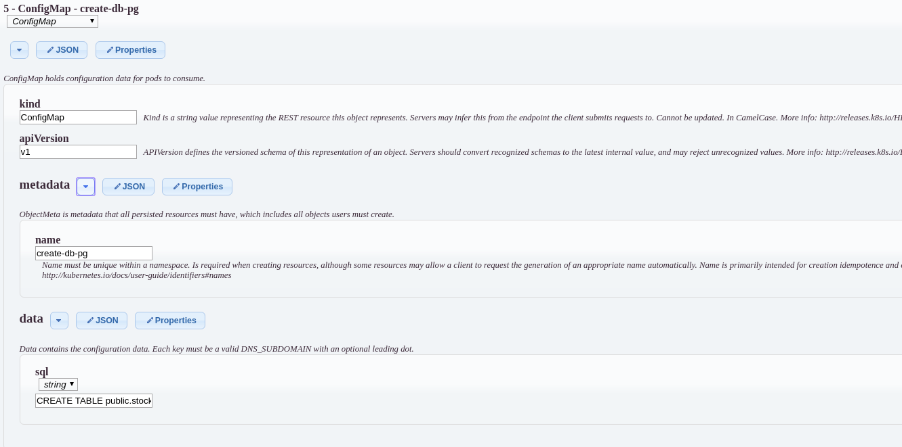
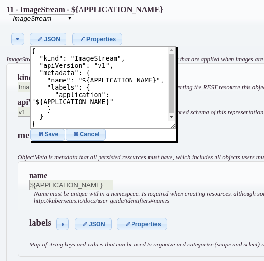
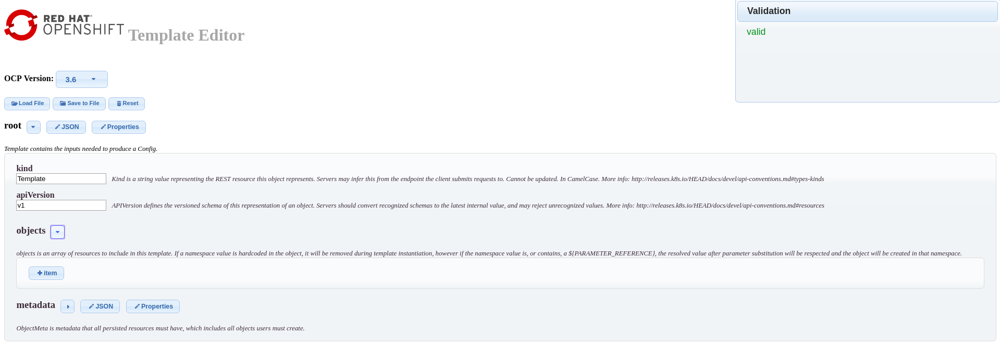

# **Openshift Template Visual Editor**

This is a simple web editor to create or modify [RedHat Openshift](http://www.openshift.com) [temmplates](https://access.redhat.com/documentation/en-us/openshift_container_platform/3.7/html/developer_guide/dev-guide-templates) in a visual way, much simpler than struggling with json or yaml directly.

You can import json or yaml templates, modify them and export them as json. The tool also validates the template and indicates found errors. It currently works with Openshift v3.6 and v3.7 schemas.

||
|---|
||
|
||
||
